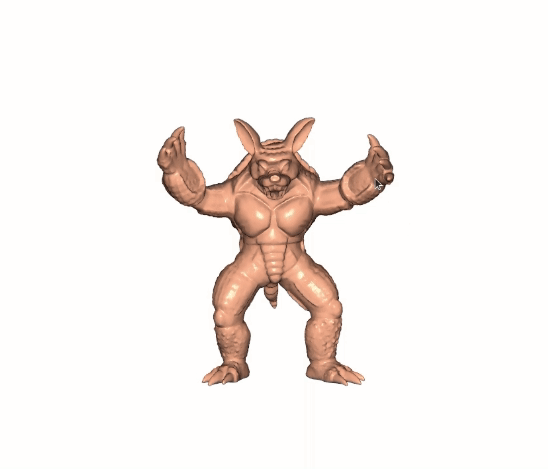

# Stable Neo-Hookean Flesh Simulation
[Stable Neo-Hookean](https://graphics.pixar.com/library/StableElasticity/paper.pdf) is a hyperelastic energy that remain stable under large deformations. This is the FEM implementation with Stable Neo-Hookean energy in [libigl](https://libigl.github.io). 

Demo video [here](https://youtu.be/OtGOPTVAOP0).

## Finite Element Method with Tetrahedron Mesh
 - `phi_linear_tetrahedron.cpp`
 
 In order to enable the physics simulation, all deformation laws have to be discretized. Tetrahedral meshes are common discrete volumetric geometry representations. All the quantity inside the volume can be represent use a shape function $\phi_i(x)$ where $x \in R^3$ is a position inside the space volume.

 The general coordinates are formed as a stack vector $q$

## Kinetic Energy
- `T_linear_tetrahedron.cpp`
- `mass_matrix_mesh.cpp`
- `mass_matrix_lnear_tetrahedron.cpp`

For a Tetrahedron, we need to consider the kinetic energy of every infitesmial piece of mass inside the tetrahedron
$$
T = \frac{1}{2}\dot{q}^TM\dot{q}
$$
where the $M$ is the per-element mass matrix

## Deformations
- `dphi_linear_tetrahedron_dX.cpp`

To determine forces due to deformation, we need to know how the nearby points have moved relative to one another. This information is captured by the **Deformation Gradient** $F$.


## The Strain Energy
- `psi_neo_hookean.cpp`

The hyperrelastic energy density $\psi$ is used to enable the elastic behavior of a deformable body. The paper propose  
$$
\psi_{\text{Stable}}(F) = \frac{\mu}{2}(I_C - 3) + \frac{\lambda}{2}(J - 1 - \frac{\mu}{\lambda})^2
$$
where $J=\text{det}(F)$, $I_C = \text{tr}(F^TF)$, $\mu$ and $\lambda$ are Lamé constants.


I also test the Neo-Hookean energy from [Bower 2009](http://solidmechanics.org/)
$$
\psi_{\text{Neo}}(F) = \frac{\mu}{2}(J^{-\frac{2}{3}}I_C - 3) + \frac{\lambda}{2}(J - 1)^2
$$



## Potential energy
- `V_linear_tetrahedron.cpp`

$$
V = \int_{\text{volume}}\psi(F) dV
$$

## Forces and Stiffness
- `dV_linear_tetrahedron_dq.cpp`
- `dV_spring_particle_dq.cpp`
- `d2V_linear_tetrahedron_dq2.cpp`
- `dpsi_neo_hookean_dF.cpp`
- `d2psi_neo_hookean_dF2.cpp`

Per-element generalized force 
$$
\text{f} = -\frac{\partial V}{\partial q}
$$
Per-element stiffness
$$
\text{K} = -\frac{\partial^2 V}{\partial q^2}
$$
To assemble the global forces vector and global stiffness matrix:
- `assemble_forces.cpp`
- `assemble_stiffness.cpp`

## Time Integration
- `newtons_method.h`
- `implicit_euler.h`

I test the Newton-type Implicit Integration scheme and Linea Search with both LDLT(fast) and Conjugate Gradient solvers(slow). LDLT can perform much faster and perform the real-time simulation.

## Skinning
- `build_skinning_matrix.cpp`

Directly run FEM on the high resolution mesh can be slow. To get the real-time simulation, I use the Skinning to mapping the motion from low resolution armadillo tetrahedron mesh to the high resolution armadillo triangle mesh.


## Dependnecy 
```
sudo apt-get install git
sudo apt-get install build-essential
sudo apt-get install cmake
sudo apt-get install libx11-dev
sudo apt-get install mesa-common-dev libgl1-mesa-dev libglu1-mesa-dev
sudo apt-get install libxrandr-dev
sudo apt-get install libxi-dev
sudo apt-get install libxmu-dev
sudo apt-get install libblas-dev
sudo apt install libxinerama-dev libxcursor-dev
```

## How to run?
Build:
```
mkdir build
cd build
cmake .. -DCMAKE_BUILD_TYPE=Release
make
```
Run with Stable Neo-Hookean
```
./stable_neohooken stable
```
Run without Stable Neo-Hookean
```
./stable_neohooken nonstable
```

## Acknowledgement
The framework of this project is based on [assignment](https://github.com/dilevin/CSC417-a3-finite-elements-3d) from Prof. David I.W. Levin.